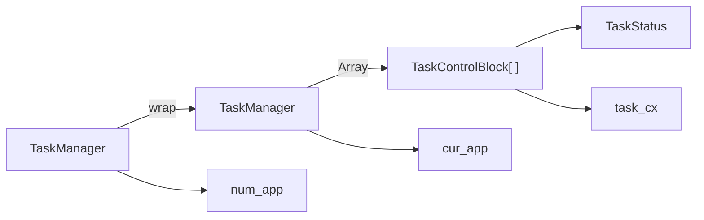
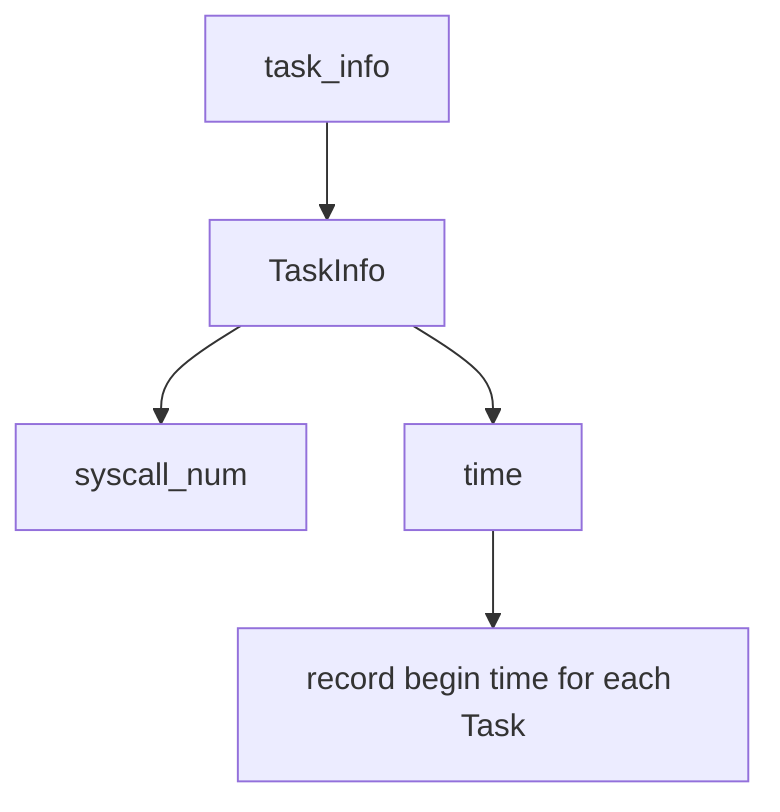

# 3 多程序和分时多任务

Created: May 8, 2024 8:52 PM
Class: Rust & 操作系统

简答题在最后

# 回顾

前面我们已经了解了 `Trap` ，通过硬件的配置进行特权级的切换。大致的过程如下：


然而在实践中，仍然发现计算机没有更好的利用起来。

- OI操作闲置了CPU
- 希望能够实现多用户同时使用的“假象”

因此这里引入概念**任务切换**，App可以主动或者被动地放弃CPU资源，使得其他应用最大化利用。进而有**任务上下文(Task Context)**，以及用于管理当前任务的任务管理器。

*注意区分任务上下文和 Trap 上下文*

- **任务切换仍然由内核完成**，这一任务的形式就是 **Trap**
- Trap进行内核和应用间的切换，内核再执行不同应用的切换

# 多程序及其切换

## __switch

用于恢复和保存应用上下文

- 接受两个指针
    - 指向当前上下文（当前上下文保存于此）
    - 指向下一个应用上下文（要恢复至寄存器的上下文来源于此）
- 在**应用层面上的换栈**

```nasm
.altmacro
.macro SAVE_SN n
    sd s\n, (\n+2)*8(a0)
.endm
.macro LOAD_SN n
    ld s\n, (\n+2)*8(a1)
.endm
    .section .text
    .globl __switch
__switch:
    # __switch(
    #     current_task_cx_ptr: *mut TaskContext,
    #     next_task_cx_ptr: *const TaskContext
    # )
    # save kernel stack of current task
    sd sp, 8(a0)
    # save ra & s0~s11 of current execution
    sd ra, 0(a0)
    .set n, 0
    .rept 12
        SAVE_SN %n
        .set n, n + 1
    .endr
    # restore ra & s0~s11 of next execution
    ld ra, 0(a1)
    .set n, 0
    .rept 12
        LOAD_SN %n
        .set n, n + 1
    .endr
    # restore kernel stack of next task
    ld sp, 8(a1)
    ret

```

# 应用管理

一个简单的管理应用的方法

- 标记应用状态
- 记录当前应用
- 记录**任务上下文**



这些信息都由 `static TASKMANAGER` 进行创建并管理。

在内存角度上，这些都位于 `.data` 段，属于**操作系统的任务管理程序**

这样以来__switch就更好理解了，内核如何切换任务上下文也十分明了。

任务管理器的调用由 `trap_handler` 完成

# 内核主动切换

让一个程序为内核负责是不切实际的——使用计时来强制切换。

那么如何实现计时？

多线程显然是不可能的

——运行在 M 特权级的 SEE 封装了一个基于硬件的 `set_timer` ，引发**S级的时钟中断**

等会，出现了更高级的中断

- 如果在处理 U 级中断时遇上了 S 级中断该如何处理？
- 嵌套Trap

解决方案：在执行第一个应用前调用 `enable_timer_interrupt()` 设置 `sie.stie`， 使得 S 特权级时钟中断不会被屏蔽。

但是还是不对，到底什么是中断屏蔽呢

先留在这，开始做作业吧

# 编程作业

## 获取任务信息

ch3 中，我们的系统已经能够支持多个任务分时轮流运行，我们希望引入一个新的系统调用 `sys_task_info` 以获取当前任务的信息，定义如下：

```rust
**fn** sys_task_info(ti: ***mut** TaskInfo) -> isize
```

- syscall ID: 410
- 查询当前正在执行的任务信息，任务信息包括任务控制块相关信息（任务状态）、任务使用的系统调用及调用次数、系统调用时刻距离任务第一次被调度时刻的时长（单位ms）。

```rust
**struct** **TaskInfo** {
    status: **TaskStatus**,
    syscall_times: [u32; MAX_SYSCALL_NUM],
    time: usize
}
```

- **参数：**ti: 待查询任务信息
- 返回值：执行成功返回0，错误返回-1
- **说明：**相关结构已在框架中给出，只需添加逻辑实现功能需求即可。在我们的实验中，系统调用号一定小于 500，所以直接使用一个长为 `MAX_SYSCALL_NUM=500` 的数组做桶计数。运行时间 time 返回系统调用时刻距离任务第一次被调度时刻的时长，也就是说这个时长可能包含该任务被其他任务抢占后的等待重新调度的时间。由于查询的是当前任务的状态，因此 TaskStatus 一定是 Running。（助教起初想设计根据任务 id 查询，但是既不好定义任务 id 也不好写测例，遂放弃 QAQ）调用 `sys_task_info` 也会对本次调用计数。
- **提示：**大胆修改已有框架！除了配置文件，你几乎可以随意修改已有框架的内容。程序运行时间可以通过调用 `get_time()` 获取，注意任务运行总时长的单位是 ms。系统调用次数可以考虑在进入内核态系统调用异常处理函数之后，进入具体系统调用函数之前维护。阅读 TaskManager 的实现，思考如何维护内核控制块信息（可以在控制块可变部分加入需要的信息）。虽然系统调用接口采用桶计数，但是内核采用相同的方法进行维护会遇到什么问题？是不是可以用其他结构计数？

## 分析



1. 记录时间只需要修改 `run_next_task` 和 `run_first_task` ，在对 `TaskManagerInner` 内部加入`tasks_begin_time` 进行记录
2. 接下来处理 `syscall_num` ，准备使用一个静态结构存储所有App id所对应的系统调用次数，并进行一定的封装。
    - 为什么要使用 `lazy_static + static ref`
        - 这是 rust 单例模式的一种常见实现方式
    - 为什么不将这些信息都合并进入 `TaskControlBlock` 中呢？

## 实现中的问题

### 生命周期

```rust
pub struct TaskManager {
    /// total number of tasks
    num_app: usize,
    /// use inner value to get mutable access
    inner: UPSafeCell<TaskManagerInner>,
}

/// Inner of Task Manager
pub struct TaskManagerInner {
    /// task list
    tasks: [TaskControlBlock; MAX_APP_NUM],
    /// id of current `Running` task
    current_task: usize,
}

lazy_static! {
    /// Global variable: TASK_MANAGER
    pub static ref TASK_MANAGER: TaskManager = {
        let num_app = get_num_app();
        let mut tasks = [TaskControlBlock {
            task_cx: TaskContext::zero_init(),
            task_status: TaskStatus::UnInit,
            begin_time: 0,
            syscall_times: [0; MAX_SYSCALL_NUM]
        }; MAX_APP_NUM];
        for (i, task) in tasks.iter_mut().enumerate() {
            task.task_cx = TaskContext::goto_restore(init_app_cx(i));
            task.task_status = TaskStatus::Ready;
        }
        TaskManager {
            num_app,
            inner: unsafe {
                UPSafeCell::new(TaskManagerInner {
                    tasks,
                    current_task: 0,
                })
            },
        }
    };
}

impl TaskManager {
    fn get_current_task(&self) -> &'static TaskControlBlock {
        let mut inner = self.inner.exclusive_access();
        let current_task = inner.current_task;
        & (inner.tasks[current_task])
    }
}

/// get current app
pub fn get_current_task() -> &'static TaskControlBlock {
    TASK_MANAGER.get_current_task()
}=
```

# 简答题

1. 正确进入 U 态后，程序的特征还应有：使用 S 态特权指令，访问 S 态寄存器后会报错。 请同学们可以自行测试这些内容（运行 [三个 bad 测例 (ch2b_bad_*.rs)](https://github.com/LearningOS/rCore-Tutorial-Test-2024S/tree/master/src/bin) ）， 描述程序出错行为，同时注意注明你使用的 sbi 及其版本。
    
    ```bash
    [kernel] PageFault in application, bad addr = 0x0, bad instruction = 0x804003ac, kernel killed it.
    [kernel] IllegalInstruction in application, kernel killed it.
    [kernel] IllegalInstruction in application, kernel killed it.
    [kernel] Panicked at src/trap/mod.rs:75 Unsupported trap Exception(LoadFault), stval = 0x18!
    ```
    
    - kernel对于禁止的指令、地址访问会直接kill，对于无权使用的系统调用会进行panick
    - 以下是我的SBI版本
    
    ```bash
    [rustsbi] RustSBI version 0.3.0-alpha.2, adapting to RISC-V SBI v1.0.0
    ```
    
2. 深入理解 [trap.S](https://github.com/LearningOS/rCore-Tutorial-Code-2024S/blob/ch3/os/src/trap/trap.S) 中两个函数 `__alltraps` 和 `__restore` 的作用，并回答如下问题:
    1. L40：刚进入 `__restore` 时，`a0` 代表了什么值。请指出 `__restore` 的两种使用情景。
        - 代表了作为函数被调用时储存在寄存器中的TrapContext指针，通过这个指针指向的信息，restore寄存器环境。
        - 一种是第一次运行第一个程序，第二种是从切换的程序中恢复上下文
    2. L43-L48：这几行汇编代码特殊处理了哪些寄存器？这些寄存器的的值对于进入用户态有何意义？请分别解释。
        
        ```rust
        ld t0, 32*8(sp)
        ld t1, 33*8(sp)
        ld t2, 2*8(sp)
        csrw sstatus, t0
        csrw sepc, t1
        csrw sscratch, t2
        ```
        
        - 处理了三个状态寄存器，sstatus标志特权级信息，用于恢复之前的特权级；sepc储存Trap发生前上一条指令的地址，用于恢复app执行进度；sscratch这里临时用于标志用户栈的地址，为之后的换栈做准备。
    3. L50-L56：为何跳过了 `x2` 和 `x4`？
        
        ```rust
        ld x1, 1*8(sp)
        ld x3, 3*8(sp)
        .set **n**, 5
        .rept 27
           LOAD_GP %**n**   .set **n**, **n**+1
        .endr
        ```
        
        - 因为这是两个特殊寄存器，前者是堆栈寄存器，即sp，后面特殊处理了；后者是线程指针，多数情况下不会被应用使用。
    4. L60：该指令之后，`sp` 和 `sscratch` 中的值分别有什么意义？
        
        ```rust
        csrrw sp, sscratch, sp
        ```
        
        - sp和sscratch中的值进行了交换，这样以来sp回到用户栈，sscratch保存内核栈。
    5. `__restore`：中发生状态切换在哪一条指令？为何该指令执行之后会进入用户态？
        - 在执行`sret`指令时，会发生以下操作：
            1. 程序计数器（PC）被设置为`sepc`寄存器的值。`sepc`寄存器在这段代码中被设置为`t1`的值，`t1`的值是从内核栈中加载的。这意味着执行将跳转到`sepc`指定的地址，这通常是发生中断或异常时正在执行的指令。
            2. `sstatus`寄存器的SIE位被设置为SPIE位的值，然后SPIE位被设置为1。`sstatus`寄存器在这段代码中被设置为`t0`的值，`t0`的值是从内核栈中加载的。这意味着中断使能状态将被恢复到进入内核模式之前的状态。
    6. L13：该指令之后，`sp` 和 `sscratch` 中的值分别有什么意义？
        
        ```rust
        csrrw sp, sscratch, sp
        ```
        
        - sp和sscratch中的值进行了交换，这样以来sp回到内核栈，sscratch保存用户栈。
    7. 从 U 态进入 S 态是哪一条指令发生的？
        - 在程序使用系统调用之后，发生Trap，也就自然进入了S态，这一步具体是由硬件完成的。